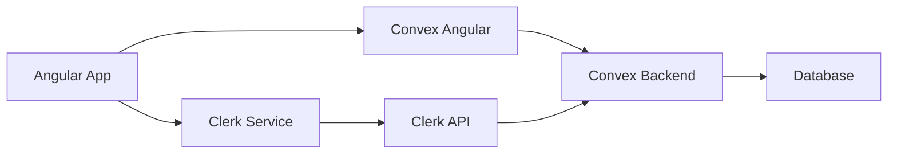

Kaizen uses Convex as its backend-as-a-service, providing real-time database operations, serverless functions, and seamless integration with Clerk authentication.

## Architecture overview

The backend integration consists of three main components:

1. **Convex** - Real-time database and serverless functions
2. **Clerk** - User authentication and session management
3. **convex-angular** - Angular bindings for Convex with signal support



## Convex setup

### Application configuration

Convex is configured in the application config:

```typescript src/app/app.config.ts
import { ApplicationConfig } from '@angular/core';
import {
  CLERK_AUTH,
  CONVEX_AUTH_GUARD_CONFIG,
  provideClerkAuth,
  provideConvex,
} from 'convex-angular';
import { ClerkAuthService } from './services/clerk-auth.service';
import { environment } from '../environments/environment.development';

export const appConfig: ApplicationConfig = {
  providers: [
    // Initialize Convex with public URL
    provideConvex(environment.convexPublicUrl),
    
    // Configure Clerk authentication provider
    { provide: CLERK_AUTH, useClass: ClerkAuthService },
    provideClerkAuth(),
    
    // Set login route for auth guard
    { 
      provide: CONVEX_AUTH_GUARD_CONFIG, 
      useValue: { loginRoute: '/auth/login' } 
    },
  ],
};
```

Key configuration (src/app/app.config.ts:18):

- `provideConvex()` initializes the Convex client
- `CLERK_AUTH` token links Clerk authentication to Convex
- `CONVEX_AUTH_GUARD_CONFIG` defines where to redirect unauthenticated users

### Database schema

The Convex schema defines all database tables and indexes:

```typescript convex/schema.ts
import { defineSchema, defineTable } from 'convex/server';
import { v } from 'convex/values';

export default defineSchema({
  // User table with token-based lookup
  users: defineTable({
    name: v.string(),
    tokenIdentifier: v.string(),
  }).index('by_token', ['tokenIdentifier']),
  
  // Character progression data
  character: defineTable({
    id: v.string(),
    userId: v.id('users'),
    prestigeLevel: v.number(),
    prestigeMultipliers: v.object({
      strength: v.number(),
      intelligence: v.number(),
      endurance: v.number(),
    }),
    prestigeCores: v.number(),
    gold: v.number(),
    currentStage: v.number(),
    currentWave: v.number(),
  })
    .index('by_user', ['userId'])
    .index('by_user_and_id', ['userId', 'id']),
    
  // Gold-based upgrades
  goldUpgrades: defineTable({
    id: v.string(),
    currentLevel: v.number(),
    userId: v.id('users'),
  })
    .index('by_user', ['userId'])
    .index('by_user_and_id', ['userId', 'id']),
    
  // Prestige-based upgrades
  prestigeUpgrades: defineTable({
    id: v.string(),
    currentLevel: v.number(),
    userId: v.id('users'),
  })
    .index('by_user', ['userId'])
    .index('by_user_and_id', ['userId', 'id']),
});
```

Schema features (convex/schema.ts:4):

- **Type safety** - `v` validators ensure runtime type checking
- **Indexes** - Optimize queries by user and user+id combinations
- **Relationships** - Foreign key references using `v.id('users')`

<Note>
  Convex automatically generates TypeScript types from the schema in `convex/_generated/dataModel.d.ts`.
</Note>

## Clerk authentication

### Clerk service

The Clerk service wraps the Clerk JavaScript SDK with Angular signals:

```typescript src/app/services/clerk.service.ts
import { Injectable, signal } from '@angular/core';
import { Clerk } from '@clerk/clerk-js';
import { environment } from '../../environments/environment.development';

@Injectable({
  providedIn: 'root',
})
export class ClerkService {
  public clerk: Clerk;
  
  // Signal-based state
  public loaded = signal<boolean>(false);
  public user = signal<any>(null);
  
  constructor() {
    this.clerk = new Clerk(environment.clerkPublicKey);
    this.init();
  }
  
  private async init() {
    await this.clerk.load();
    this.loaded.set(true);
    
    // Listen for authentication changes
    this.clerk.addListener(() => {
      this.user.set(this.clerk.user ?? null);
    });
  }
  
  async openSignIn() {
    await this.clerk.openSignIn();
  }
  
  async openSignUp() {
    await this.clerk.openSignUp();
  }
  
  async signOut() {
    await this.clerk.signOut();
    this.user.set(null);
  }
  
  async getToken(options?: { 
    template?: string; 
    skipCache?: boolean 
  }): Promise<string | null> {
    const token = await this.clerk.session?.getToken(options);
    return token ?? null;
  }
}
```

Key methods (src/app/services/clerk.service.ts:8):

- `loaded` - Signal indicating Clerk has initialized
- `user` - Signal containing current user or null
- `getToken()` - Retrieves JWT for Convex authentication

### Clerk auth provider

The auth provider connects Clerk to Convex:

```typescript src/app/services/clerk-auth.service.ts
import { Injectable, computed, inject } from '@angular/core';
import { ClerkAuthProvider } from 'convex-angular';
import { ClerkService } from './clerk.service';

@Injectable({
  providedIn: 'root',
})
export class ClerkAuthService implements ClerkAuthProvider {
  private clerk = inject(ClerkService);
  
  // Computed signals for auth state
  readonly isLoaded = computed(() => this.clerk.loaded());
  readonly isSignedIn = computed(() => !!this.clerk.user());
  
  async getToken(options?: { template?: string; skipCache?: boolean }) {
    try {
      return (await this.clerk.getToken(options)) ?? null;
    } catch {
      return null;
    }
  }
}
```

This service (src/app/services/clerk-auth.service.ts:8):

- Implements the `ClerkAuthProvider` interface
- Provides `getToken()` method for Convex authentication
- Exposes computed signals for auth state

### Clerk configuration

Convex authentication is configured to accept Clerk JWTs:

```typescript convex/auth.config.ts
import { AuthConfig } from 'convex/server';

export default {
  providers: [
    {
      domain: process.env.CLERK_JWT_ISSUER_DOMAIN!,
      applicationID: 'convex',
    },
  ],
} satisfies AuthConfig;
```

<Warning>
  The JWT template in Clerk must be named exactly "convex" to match the `applicationID` in this configuration.
</Warning>

## Queries and mutations

### Defining backend functions

Convex functions are defined using `query` and `mutation` builders:

```typescript convex/character.ts
import { getCurrentUser } from './lib/auth';
import { mutation, query } from './_generated/server';
import { v } from 'convex/values';

// Query - read operations
export const getCharacter = query({
  args: {},
  handler: async (ctx) => {
    // Get authenticated user
    const user = await getCurrentUser(ctx);
    if (!user) return null;
    
    // Query character for this user
    const character = await ctx.db
      .query('character')
      .withIndex('by_user', (q) => q.eq('userId', user._id))
      .unique();
    
    return character;
  },
});

// Mutation - write operations
export const updateCharacter = mutation({
  args: {
    id: v.string(),
    prestigeLevel: v.number(),
    prestigeMultipliers: v.object({
      strength: v.number(),
      intelligence: v.number(),
      endurance: v.number(),
    }),
    prestigeCores: v.number(),
    gold: v.number(),
    currentStage: v.number(),
    currentWave: v.number(),
  },
  handler: async (ctx, args) => {
    const user = await getCurrentUser(ctx);
    if (!user) throw new Error('Not authenticated');
    
    // Find existing character
    const existing = await ctx.db
      .query('character')
      .withIndex('by_user_and_id', (q) => 
        q.eq('userId', user._id).eq('id', args.id)
      )
      .first();
    
    const { id, ...updateData } = args;
    
    if (existing) {
      // Update existing record
      await ctx.db.patch(existing._id, updateData);
    } else {
      // Create new record
      await ctx.db.insert('character', {
        ...args,
        userId: user._id,
      });
    }
  },
});
```

Function patterns (convex/character.ts:5):

- Validate authentication using `getCurrentUser()`
- Use indexes for efficient queries
- Implement upsert pattern (update or insert)
- Validate arguments with `v` validators

### Authentication helper

Shared authentication logic is extracted to a helper:

```typescript convex/lib/auth.ts
import { MutationCtx, QueryCtx } from '../_generated/server';
import { Doc } from '../_generated/dataModel';

export async function getCurrentUser(
  ctx: QueryCtx | MutationCtx
): Promise<Doc<'users'> | null> {
  const identity = await ctx.auth.getUserIdentity();
  if (!identity) {
    return null;
  }
  
  return await ctx.db
    .query('users')
    .withIndex('by_token', (q) => 
      q.eq('tokenIdentifier', identity.tokenIdentifier)
    )
    .first();
}
```

This helper (convex/lib/auth.ts:4):

- Gets the current authenticated identity from Clerk
- Looks up the corresponding user in the database
- Returns null for unauthenticated requests

### User creation

New users are automatically created on first login:

```typescript convex/users.ts
import { mutation } from './_generated/server';

export const store = mutation({
  args: {},
  handler: async (ctx) => {
    const identity = await ctx.auth.getUserIdentity();
    if (!identity) {
      throw new Error('No user identity found');
    }
    
    // Check if user already exists
    const user = await ctx.db
      .query('users')
      .withIndex('by_token', (q) => 
        q.eq('tokenIdentifier', identity.tokenIdentifier)
      )
      .unique();
    
    if (user !== null) {
      // Update name if changed
      if (user.name !== identity.name) {
        await ctx.db.patch(user._id, { name: identity.name });
      }
      return user._id;
    }
    
    // Create new user
    return await ctx.db.insert('users', {
      name: identity.name ?? 'Anonymous',
      tokenIdentifier: identity.tokenIdentifier,
    });
  },
});
```

This mutation (convex/users.ts:3):

- Is called after successful Clerk authentication
- Creates user record if it doesn't exist
- Updates user name if it has changed

## Angular integration

### Using queries in services

Queries are injected using `injectQuery()`:

```typescript
import { injectQuery } from 'convex-angular';
import { api } from '../../../convex/_generated/api';

export class CharacterService {
  private getCharacterFromDatabase = injectQuery(
    api.character.getCharacter,
    () => ({}) // Arguments function
  );
  
  constructor() {
    effect(() => {
      // Access query result as signal
      const dbCharacter = this.getCharacterFromDatabase.data();
      if (dbCharacter) {
        this.character.set(dbCharacter);
      }
    });
  }
}
```

Query features:

- `.data()` returns a signal that updates automatically
- Queries are reactive - changes trigger signal updates
- `.isLoading()` signal indicates query status

### Using mutations in services

Mutations are injected using `injectMutation()`:

```typescript
import { injectMutation } from 'convex-angular';

export class CharacterService {
  private databaseUpdateMutation = injectMutation(
    api.character.updateCharacter
  );
  
  public updateDatabase(): void {
    const characterToSave = {
      id: this.character().id,
      prestigeLevel: this.character().prestigeLevel,
      prestigeMultipliers: this.character().prestigeMultipliers,
      prestigeCores: this.character().prestigeCores,
      gold: this.character().gold,
      currentStage: this.character().currentStage,
      currentWave: this.character().currentWave,
    };
    
    // Call mutation
    this.databaseUpdateMutation.mutate(characterToSave);
  }
}
```

Mutation features:

- `.mutate()` calls the backend function
- Returns a promise for async handling
- Automatically includes authentication token

### Batch mutations

Multiple records can be updated in a single mutation:

```typescript convex/goldUpgrades.ts
export const updateGoldUpgradeLevels = mutation({
  args: { 
    upgrades: v.array(v.object({ 
      id: v.string(), 
      currentLevel: v.number() 
    })) 
  },
  handler: async (ctx, args) => {
    const user = await getCurrentUser(ctx);
    if (!user) throw new Error('Not authenticated');
    
    // Update all upgrades in parallel
    await Promise.all(
      args.upgrades.map(async (upgrade) => {
        const existing = await ctx.db
          .query('goldUpgrades')
          .withIndex('by_user_and_id', (q) => 
            q.eq('userId', user._id).eq('id', upgrade.id)
          )
          .first();
        
        if (existing) {
          await ctx.db.patch(existing._id, { 
            currentLevel: upgrade.currentLevel 
          });
        }
      })
    );
  },
});
```

Called from the service:

```typescript
public updateDatabase(): void {
  const upgradesToSave = this.upgrades().map(upgrade => ({
    id: upgrade.id,
    currentLevel: upgrade.currentLevel,
  }));
  
  this.databaseUpdateMutation.mutate({ upgrades: upgradesToSave });
}
```

## Route protection

### Auth guard

Protect routes using `ConvexAuthGuard`:

```typescript src/app/app.routes.ts
import { Routes } from '@angular/router';
import { ConvexAuthGuard } from 'convex-angular';

export const routes: Routes = [
  {
    path: 'auth/login',
    component: LoginComponent,
  },
  {
    path: 'dashboard',
    component: DashboardComponent,
    canActivate: [ConvexAuthGuard], // Requires authentication
  },
  {
    path: 'character',
    component: CharacterComponent,
    canActivate: [ConvexAuthGuard],
  },
];
```

The guard:

- Checks if user is authenticated via Clerk
- Redirects to login route if not authenticated
- Uses `loginRoute` from `CONVEX_AUTH_GUARD_CONFIG`

## Best practices

<AccordionGroup>
  <Accordion title="Always authenticate on the backend">
    Never trust client-side authentication state:
    
    ```typescript
    // Good - check auth in every function
    export const updateCharacter = mutation({
      handler: async (ctx, args) => {
        const user = await getCurrentUser(ctx);
        if (!user) throw new Error('Not authenticated');
        // ... rest of function
      },
    });
    
    // Bad - no auth check
    export const updateCharacter = mutation({
      handler: async (ctx, args) => {
        await ctx.db.insert('character', args);
      },
    });
    ```
  </Accordion>
  
  <Accordion title="Use indexes for queries">
    Always query with indexes for performance:
    
    ```typescript
    // Good - uses index
    await ctx.db
      .query('character')
      .withIndex('by_user', (q) => q.eq('userId', user._id))
      .first();
    
    // Bad - full table scan
    const all = await ctx.db.query('character').collect();
    const userChar = all.find(c => c.userId === user._id);
    ```
  </Accordion>
  
  <Accordion title="Validate all mutation arguments">
    Use Convex validators for runtime type safety:
    
    ```typescript
    export const updateLevel = mutation({
      args: {
        level: v.number(),
        // Add custom validation
        level: v.union(
          v.number(),
          v.pipe(v.number(), v.min(1), v.max(100))
        ),
      },
      handler: async (ctx, args) => {
        // args.level is guaranteed to be 1-100
      },
    });
    ```
  </Accordion>
  
  <Accordion title="Handle loading and error states">
    Always handle query states in the UI:
    
    ```typescript
    export class CharacterComponent {
      query = injectQuery(api.character.getCharacter, () => ({}));
      
      get character() {
        return this.query.data();
      }
      
      get isLoading() {
        return this.query.isLoading();
      }
      
      get error() {
        return this.query.error();
      }
    }
    ```
  </Accordion>
</AccordionGroup>

## Common patterns

### Optimistic updates

```typescript
export class UpgradeService {
  async purchaseUpgrade(upgradeId: string) {
    // Update local state immediately
    this.upgrades.update(upgrades =>
      upgrades.map(u => 
        u.id === upgradeId 
          ? { ...u, currentLevel: u.currentLevel + 1 }
          : u
      )
    );
    
    try {
      // Persist to backend
      await this.mutation.mutate({ upgradeId });
    } catch (error) {
      // Rollback on failure
      this.upgrades.update(upgrades =>
        upgrades.map(u => 
          u.id === upgradeId 
            ? { ...u, currentLevel: u.currentLevel - 1 }
            : u
        )
      );
      throw error;
    }
  }
}
```

### Paginated queries

```typescript
// Backend
export const listCharacters = query({
  args: {
    paginationOpts: paginationOptsValidator,
  },
  handler: async (ctx, args) => {
    return await ctx.db
      .query('character')
      .paginate(args.paginationOpts);
  },
});

// Frontend
export class CharacterListService {
  private listQuery = injectQuery(
    api.character.listCharacters,
    () => ({ paginationOpts: { numItems: 10, cursor: null } })
  );
  
  loadMore() {
    const currentPage = this.listQuery.data();
    if (currentPage?.continueCursor) {
      // Update query args to load next page
    }
  }
}
```

## Next steps

<CardGroup cols={2}>
  <Card title="State management" icon="signal" href="/development/state-management">
    Learn how signals work with Convex queries
  </Card>
  
  <Card title="Project structure" icon="folder-tree" href="/development/project-structure">
    See how backend files are organized
  </Card>
</CardGroup>